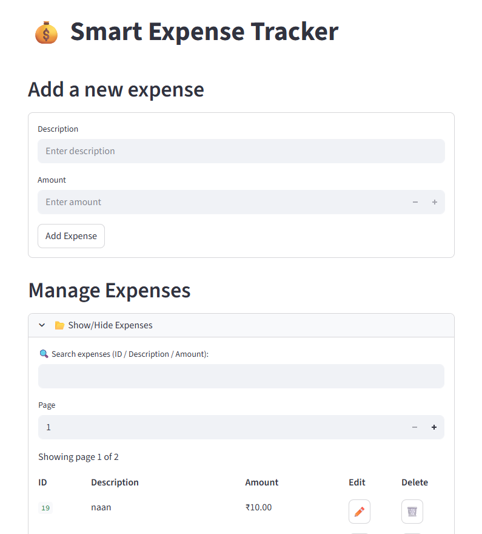
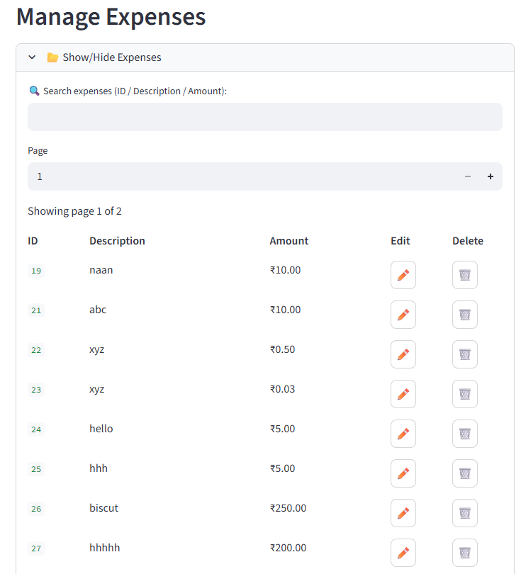
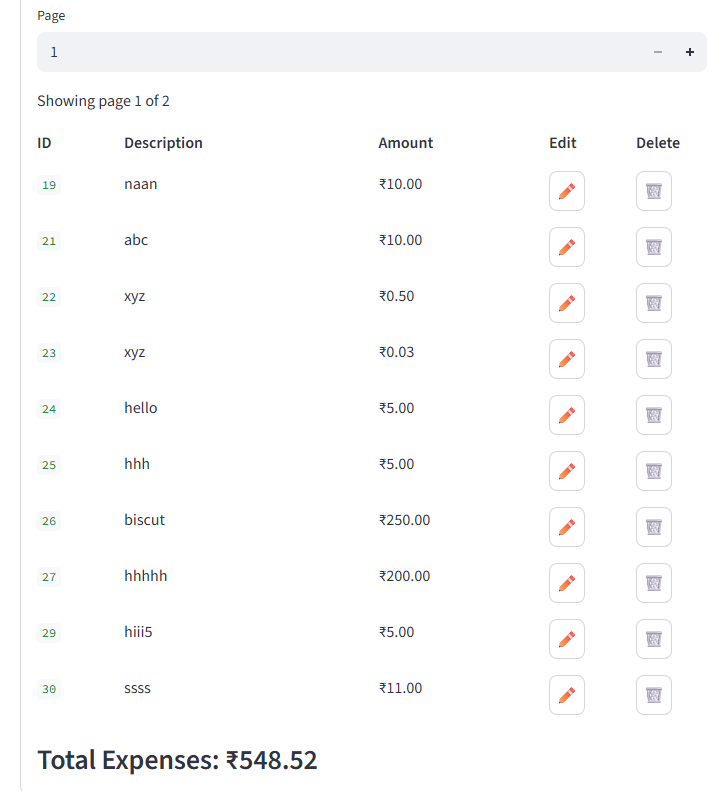

# Smart Expense Tracker

A simple and professional expense tracking app built with **FastAPI** (backend) and **Streamlit** (frontend).

## ✨ Features
- Add, edit, delete expenses
- Search and pagination
- Clean, recruiter-friendly UI
- SQLite database integration

## 🚀 Installation
To run this project on your local machine, follow these steps:

Clone the repository:
```bash
git clone https://github.com/UmarUdx/smart-expense-tracker.git  


# Navigate into the project folder
cd smart-expense-tracker

# Install dependencies
pip install -r requirements.txt

# Run the app
streamlit run app.py

# 📸 Screenshots

### Home Page


### Add Expense Page


### Search & Pagination


### Expense Summary / Dashboard


