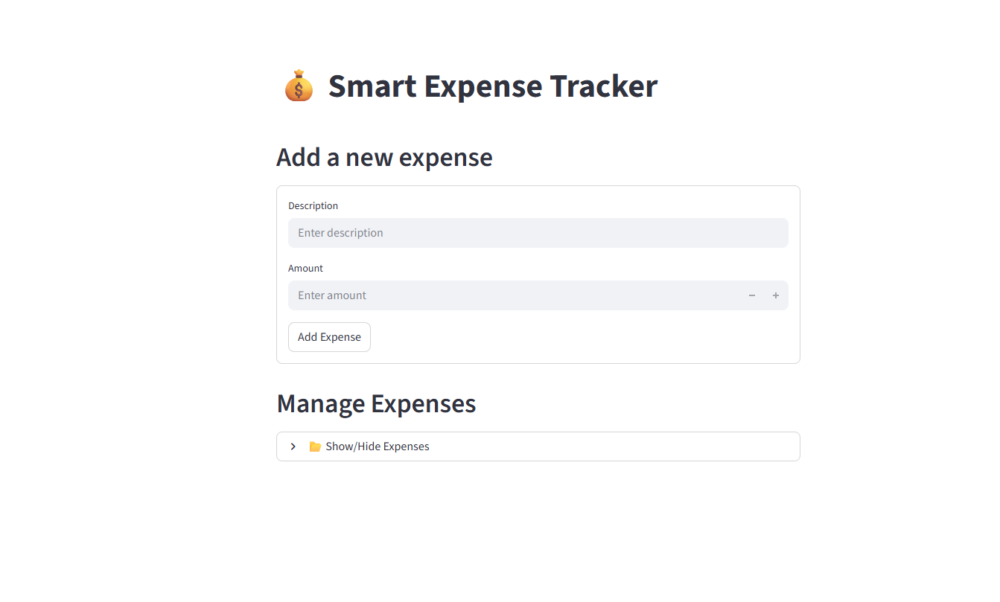

# 💰 Smart Expense Tracker

A simple and professional expense tracking app built with **FastAPI** (backend) and **Streamlit** (frontend).

---

## ✨ Features
- Add, edit, delete expenses
- Search and pagination
- Clean, recruiter-friendly UI
- SQLite database integration

---

## 🚀 Installation
To run this project on your local machine, follow these steps:

<<<<<<< HEAD
Clone the repository:bash
git clone https://github.com/UmarUdx/smart-expense-tracker.git  
=======
**Clone the repository:**
```bash
git clone https://github.com/UmarUdx/smart-expense-tracker.git
```
>>>>>>> d50f768 (Update README and other changes)

**Navigate into the project folder:**
```bash
cd smart-expense-tracker
```

**Install dependencies:**
```bash
pip install -r requirements.txt
```

**Run the backend (FastAPI):**
```bash
uvicorn main:app --reload
```

**Run the frontend (Streamlit):**
```bash
streamlit run app.py
```

---

## 📁 Project Structure (example)
```
smart-expense-tracker/
├─ app.py
├─ main.py
├─ requirements.txt
├─ image/
│  ├─ screenshot1.png
│  ├─ screenshot2.png
│  ├─ screenshot3.png
│  └─ screenshot4.png
└─ README.md
```

---

# 📸 Screenshots


### Home Page


### Add Expense Page


### Search & Pagination


### Expense Summary / Dashboard


---
